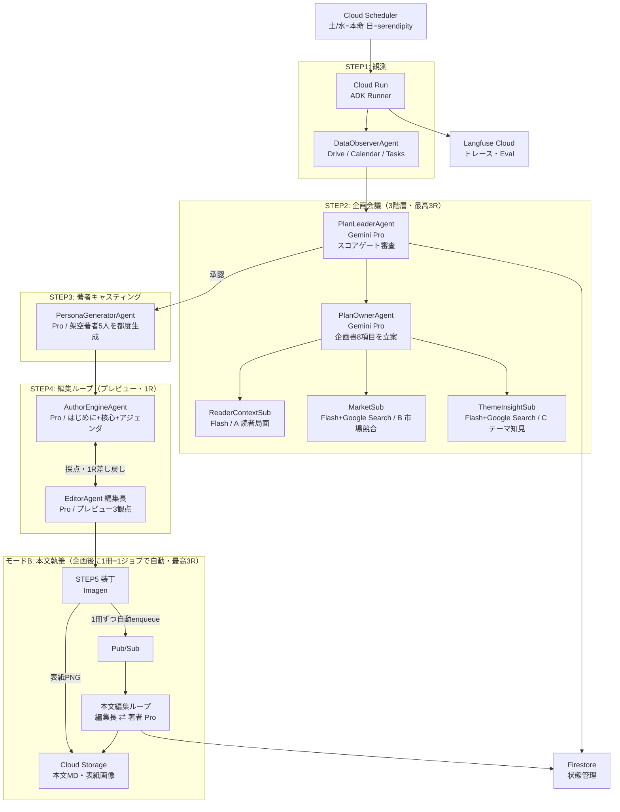

# Publishr — あなた専属の、AI出版社。

> 百万部のベストセラーより、あなたのための一冊。


---

## What is Publishr?

出版社は「最大公約数」しか出せない。あなたの今の状況・関心・悩みにフィットした本は、誰も書いてくれない。

**Publishr** は、あなたの Google Drive・Calendar・Tasks を観測し、「いま何を読むべきか・誰に書かせるべきか」を自律的に判断して、毎週あなた専用の本を出版する AI エージェントシステムです。

| 課題 | Publishr の答え |
|------|----------------|
| 自分の関心は言語化できない | Drive/Calendar 観測で自律推定し企画へ転化 |
| 自分に合った本が見つからない | テーマ×著者スタイルの組み合わせを毎週新生成 |
| 良書を探す時間がない | 毎週、棚に新刊が「入荷」される |

---

## Demo

<!-- TODO: add demo gif (book shelf → reading → archive) after recording -->

**デモ動画**: <!-- TODO: YouTube限定公開URL（録画後に追記）-->

**デモの流れ**:
1. 初回登録（業界・職種・関心をタップ式で入力）＋ Google OAuth 同意
2. Cloud Scheduler が週3回自動起動（水・土=本命、日=serendipity）→ Drive/Calendar/Tasks を観測し企画3階層会議＋本文執筆まで一気通貫
3. **アプリを開くと棚に新刊が入荷**（各冊に AI 生成（Imagen）の表紙＋入荷理由付き）— **届いた瞬間に全文が読める**（配本runで作り切り済み）
4. 本文を読む → ハイライト・★評価 → 気に入ったら「書庫に保存」（永続保存）
5. FB が次サイクルの企画・著者選定へ反映

---

## Why Multi-Agent?

> 「なぜマルチエージェントでなければならないか？」への正直な回答

単一の LLM 呼び出しで「パーソナライズされた良い企画」を出すことは、構造的に2つの理由で不可能です。

### 1. リサーチサブエージェント：外部実データの注入

調査サブ（**B 市場・競合** と **C テーマ知見**）は **Google Search grounding** を使い、「今この瞬間の売れ筋・時事トレンド・業界ニュース」をリアルタイムで取得します。単一 LLM の訓練データは過去のスナップショット。外部検索なしでは「それらしい企画」止まりで、読者の今の状況に刺さる根拠が持てません。

### 2. スコアゲートの差し戻しループ：反復改善

`PlanLeaderAgent` が企画を **4観点×25点（計100点）** でルーブリック採点し、閾値70点未満なら `PlanOwnerAgent` へ差し戻し（最大3ラウンド）。

```
Round 1: score=58 → 差し戻し（relevance が低い、理由付きフィードバック）
Round 2: score=73 → 承認 ✅
```

「自分の出力を自分が採点して突き返す」反復改善は、単一の生成呼び出しでは構造的に実現できません。

---

## Architecture



**エージェント構成まとめ**:

> モデル＝ハイブリッド（判断が重い工程＝Pro／観測寄り＝Flash）。

| エージェント | モデル | 役割 |
|---|---|---|
| DataObserverAgent（ツール） | — | Drive/Calendar/Tasks 観測・要約 |
| ReaderAnalystAgent | Gemini **Pro** | 読者分析（週1・土朝・3層Profile） |
| PlanLeaderAgent | Gemini **Pro** | 企画スコアリング・差し戻し判定（最高3R） |
| PlanOwnerAgent | Gemini **Pro** | 調査3観点を統合し企画書8項目を立案 |
| 調査サブ×3（ReaderContext/Market/ThemeInsight） | Gemini Flash（B・C＋Google Search） | 読者局面・市場競合・テーマ知見の調査 |
| PersonaGeneratorAgent（キャスティング編集者） | Gemini **Pro** | 架空著者5人の都度生成 |
| AuthorEngineAgent | Gemini **Pro** | はじめに＋核心メッセージ＋アジェンダ／本文執筆（人格着せ替え） |
| EditorAgent（編集長） | Gemini **Pro** | プレビュー編集(STEP4・1R)／本文編集(モードB・最高3R)の採点・差し戻し |
| WritingWorker（本文編集ループ） | Gemini **Pro** | 企画された本を1冊=1ジョブ（Pub/Sub）で編集長⇄著者ループ約100p執筆→published |

---

## Tech Stack

| カテゴリ | 技術 |
|---|---|
| エージェントフレームワーク | Google Agent Development Kit (ADK) |
| LLM | Vertex AI Gemini ハイブリッド（判断が重い工程＝Pro／観測寄り＝Flash） |
| 画像生成 | Vertex AI Imagen（表紙） |
| 実行基盤 | Cloud Run（API・バッチ・執筆ワーカー） |
| スケジューリング | Cloud Scheduler（週3回：土/水/日） |
| イベント駆動 | Pub/Sub（配本run→本文執筆ジョブ） |
| データベース | Firestore（状態管理・ユーザーデータ） |
| ストレージ | Cloud Storage（本文MD・表紙画像） |
| 認証 | Firebase Auth + Google OAuth（Drive/Calendar/Tasks） |
| 秘密鍵管理 | Secret Manager |
| 可観測性 | Langfuse Cloud（トレース・Eval・スコアログ） |
| CI/CD | GitHub Actions（main マージ→verify→Cloud Run 自動デプロイ・WIF keyless） |
| フロントエンド | Next.js（App Router・`apps/web`）＋ Firebase App Hosting |

---

## Features

- 🗓️ **自律企画** — Cloud Scheduler が週3回 朝6時（水・土＝本命、日＝serendipity）起動。Drive/Calendar/Tasks を読んで今週の「読むべきテーマ」を自律推定。本命は関心の中心から、serendipity は隣接/反対/飛躍/ニッチの出会い枠から仕立てる
- 🤖 **3階層の企画会議** — サブ（実データ）→ 担当者（立案）→ リーダー（スコア審査）。70点未満は差し戻し
- ✍️ **著者ペルソナの都度生成** — テーマが決まるたびに架空の著者を生成。同テーマの別切り口で複数冊を提案
- 📖 **入荷した瞬間に全文が読める** — 配本runで本文まで自動執筆（週3回）。1冊=1ジョブ（Pub/Sub）で約100pを編集長⇄著者ループで仕上げ published に。本文は非公開 Cloud Storage に退避し、サーバ側 read で配信
- 🎨 **AI 生成の表紙** — Vertex Imagen で1冊ずつ表紙を生成（非公開 GCS＋サーバ側配信）。生成失敗時は CSS 装丁にフォールバック
- 📚 **書店メタファーUI** — 「入荷・読む・書庫保存」の自然な動線。入荷理由を付記してAIの判断を可視化。棚は30日で入れ替わり、「書庫に保存」した本だけ永続保存
- ⭐ **学習ループ**（C1.8） — 過去本の評価・読了率・いいね/いまいち＋お気に入り著者・読み口を翌サイクルの企画に反映。STEP1読者分析が `readingBehavior`（feedbackSummary/stylePreference/recentReads）へ集約し、STEP2企画が「刺さった軸を強め・不発/既読の被りを避ける」。反応が無い初回は観測ベースのまま（仕組みは `docs/design/agent-io-contract.md §3`）
- 🔒 **マルチユーザー対応** — Firestore ownerUid 分離でユーザー間データを完全分離

---

## Getting Started

### 前提条件

- Python 3.11+
- Node.js 20+（フロントエンド）
- Google Cloud SDK (`gcloud`)
- Google ADK SDK
- GCP プロジェクト（Vertex AI・Firestore・Cloud Run 有効化済み）
- Langfuse Cloud アカウント

### 環境変数

`.env.example` をコピーして `.env` を作成:

```bash
cp .env.example .env
```

既定値は**オフライン・決定的・課金ゼロ**（mock）で動くように振ってあります。本番（実 Vertex/GCP）は下表の「本番値」列を Cloud Run の env／Secret Manager で与えます。

**フロントエンド（`apps/web`・`NEXT_PUBLIC_*` は build 時に焼き込み）**

| 変数 | 役割 | ローカル既定 | 本番値 |
|---|---|---|---|
| `NEXT_PUBLIC_DATA_SOURCE` | データ取得元 `mock`/`bff`/`firestore` | `bff` | `firestore` |
| `NEXT_PUBLIC_API_URL` | BFF のベース URL | `http://localhost:8000` | Cloud Run URL |
| `NEXT_PUBLIC_FIREBASE_*` | Firebase Auth 構成（apiKey/authDomain/projectId 等） | — | Firebase コンソール値 |
| `NEXT_PUBLIC_GOOGLE_CLIENT_ID` | Drive Picker（GIS）用 OAuth クライアント | — | GCP 発行値 |

**BFF コア（`apps/api`）**

| 変数 | 役割 | ローカル既定 | 本番値 |
|---|---|---|---|
| `DATA_SOURCE` | リポジトリ実装 `mock`/`firestore` | `mock` | `firestore` |
| `PUBLISHR_LLM` | エージェントの LLM `mock`/`vertex` | `mock` | `vertex` |
| `PUBLISHR_OBSERVE` | 観測ソース `fixture`/`google`（失敗時 fixture 自動フォールバック） | `fixture` | `google` |
| `GOOGLE_GENAI_USE_VERTEXAI` | ADK を Vertex 経由にする | — | `TRUE` |
| `GOOGLE_CLOUD_PROJECT` | GCP プロジェクト ID | — | `publishr-498123` |
| `GOOGLE_CLOUD_LOCATION` | Vertex リージョン（Pro クォータ都合で us-central1） | `asia-northeast1` | `us-central1` |

**企画・本文の規模／ループ**

| 変数 | 役割 | ローカル既定 | 本番値 |
|---|---|---|---|
| `PUBLISHR_MAX_BOOKS_PER_RUN` | 1 run で生成する冊数（600s上限とのバランス） | `2` | `4` |
| `PUBLISHR_SET_PIPELINE` | 4テーマ 1-1-1-1 のセット企画 | `true` | `true` |
| `PUBLISHR_EDITOR_ROUNDS` | STEP4 プレビュー編集の差し戻し上限 | `1` | `1` |
| `PUBLISHR_BODY_EDIT_ROUNDS` | モードB本文編集ループの最高改稿R | `3` | `3` |
| `PUBLISHR_BODY_CHAR_TARGET` | 本全体の目標文字数（dev は小さく） | `12000` | `12000` |
| `ENABLE_IMAGEN` | 表紙を Imagen 生成する | `false` | `true` |

**キュー（Pub/Sub・C2.2）**

| 変数 | 役割 | ローカル既定 | 本番値 |
|---|---|---|---|
| `QUEUE` | 執筆/企画キュー `mock`(in-process)/`pubsub` | `mock` | `pubsub` |
| `PUBSUB_TOPIC` / `PUBSUB_PLANNING_TOPIC` | 本文/企画ジョブのトピック | `publishr-writing` / `publishr-planning` | 同左 |
| `PUBSUB_PUSH_SA` | push を許可する SA（OIDC 検証） | 空（検証スキップ） | `publishr-pubsub-push@…` |
| `PUBSUB_PUSH_AUDIENCE` / `PUBSUB_PLAN_PUSH_AUDIENCE` | worker push の OIDC audience（=各 endpoint URL） | 空 | 各 worker URL |

**認証・OAuth・課金ガード**

| 変数 | 役割 | ローカル既定 | 本番値 |
|---|---|---|---|
| `GOOGLE_OAUTH_CLIENT_ID` / `GOOGLE_OAUTH_CLIENT_SECRET` | Drive/Calendar/Tasks 連携（空なら 503） | 空 | Secret Manager 参照 |
| `PUBLISHR_OAUTH_STATE_SECRET` | state（CSRF/uid 紐付け）の HMAC 鍵 | 空 | Secret Manager 参照 |
| `PUBLISHR_OAUTH_REDIRECT_URI` / `PUBLISHR_WEB_APP_URL` | callback 戻り先 / フロント戻り先 | `localhost:8000` / `localhost:3000` | 実 URL |
| `PUBLISHR_REQUIRE_RESERVE_AUTH` | 課金アクションを認証ユーザー限定（fail-closed） | `false` | `1` |
| `DEMO_UID` | Firestore オーナーフィルタの既定 uid | 空 | 佐倉の実 UID |

**シークレット保存・ストレージ（C3.3）**

| 変数 | 役割 | ローカル既定 | 本番値 |
|---|---|---|---|
| `PUBLISHR_OAUTH_TOKEN_STORE` | refresh token 保存先 `file`/`secret_manager` | `file` | `secret_manager` |
| `PUBLISHR_SECRET_MANAGER_PROJECT` | Secret Manager の GCP プロジェクト | 空 | `publishr-498123` |
| `PUBLISHR_BODY_STORE` | 本文の保存先 `inline`/`gcs` | `inline` | `gcs` |
| `PUBLISHR_BODY_BUCKET` / `PUBLISHR_COVER_BUCKET` | 本文 MD / 表紙 PNG の非公開バケット | `publishr-contents-498123` | 同左 |

**可観測性（Langfuse Cloud）**

| 変数 | 役割 | ローカル既定 | 本番値 |
|---|---|---|---|
| `LANGFUSE_PUBLIC_KEY` / `LANGFUSE_SECRET_KEY` | トレース・スコアログ送信鍵 | 空（no-op） | Secret Manager 参照 |
| `LANGFUSE_HOST` | Langfuse エンドポイント | `https://cloud.langfuse.com` | 同左 |

> 本番の実値はすべて **GCP Secret Manager** で管理し、Cloud Run へは `--update-secrets` で注入します（平文 env に置かない）。ローカル開発時のみ `.env` を使用してください。

### ローカル起動

```bash
# 依存インストール（uv ワークスペース・全パッケージ/extras/dev）
uv sync --all-packages --all-extras --dev
npm --prefix apps/web install

# 回帰床（mock・オフライン・決定的）。緑を維持する
make verify   # pytest（BFF＋agents）
make eval     # 企画 Eval（LLM-as-judge・mock）

# フロントエンド
npm --prefix apps/web run dev
```

#### WSL2 で書店UIをブラウザ確認する（固着回避）

WSL2 では、`next dev`（Turbopack）の開発サーバに対して書店トップ `/` を**初めてブラウザで開いた瞬間**にオンデマンドコンパイルが走り、CPU/メモリを一気に消費して **WSL2 ごとフリーズする**ことがあります。ブラウザで実機確認したい時は、`dev` ではなく **production build**（`/` が静的プリレンダーになりコンパイル不要）で起動してください。

```bash
# 1) BFF（書店データのソース。firestore モードで起動）
DATA_SOURCE=firestore GOOGLE_CLOUD_PROJECT=your-project-id \
  uv run --directory apps/api uvicorn publishr_api.main:app --host 127.0.0.1 --port 8000

# 2) Web を production ビルド（NEXT_PUBLIC_* は build 時に client bundle へ焼き込まれるため必ずビルド時に渡す）
NEXT_PUBLIC_DATA_SOURCE=bff NEXT_PUBLIC_API_URL=http://localhost:8000 \
  npm --prefix apps/web run build

# 3) production サーバで配信（→ http://localhost:3000 を開く）
NEXT_PUBLIC_DATA_SOURCE=bff NEXT_PUBLIC_API_URL=http://localhost:8000 \
  npm --prefix apps/web run start
```

- production では `/`（書店トップ）が `○`=静的、動的ルート（`ƒ`、本詳細など）もビルド済みコードの実行のみなので、**回遊しても固まりません**（固着するのは `next dev` の初回 Turbopack コンパイルだけ）。
- `apps/web/next.config.ts` の `output:"standalone"` により `next start` は `does not work with output: standalone` 警告を出しますが、`/`・JSチャンク共に 200 で配信でき**実害はありません**（standalone サーバへ切替不要）。
- 入荷一覧はブラウザが client 側で BFF（`NEXT_PUBLIC_API_URL`/books）を叩いて描画します。`/healthz` が `{"dataSource":"firestore"}`、`/books` が5冊返ることを確認してから開くと確実です。
- 固まらない代替として、デプロイ済み URL を開くのも可（デモ環境）: `https://publishr--publishr-498123.asia-east1.hosted.app`

### Cloud Run デプロイ

**自動（既定）**: `main` に push すると GitHub Actions（`.github/workflows/ci.yml`）が verify 緑を確認のうえ、**WIF keyless**（鍵レス）認証で Cloud Run へ自動デプロイします。ビルドは**ルート `Dockerfile`**（`--source .`）が正本です。

```yaml
# ci.yml の Deploy ステップ（抜粋）— 手元から手動で打つときも同じコマンド
gcloud run deploy publishr-api \
  --source . \
  --region asia-northeast1 \
  --service-account publishr-runner@publishr-498123.iam.gserviceaccount.com \
  --update-env-vars=PUBLISHR_BODY_STORE=gcs,PUBLISHR_BODY_BUCKET=publishr-contents-498123,ENABLE_IMAGEN=true,PUBLISHR_COVER_BUCKET=publishr-contents-498123 \
  --update-secrets=LANGFUSE_HOST=…:latest,LANGFUSE_PUBLIC_KEY=…:latest,LANGFUSE_SECRET_KEY=…:latest,GOOGLE_OAUTH_CLIENT_SECRET=…:latest,PUBLISHR_OAUTH_STATE_SECRET=…:latest \
  --quiet
```

- フロント（`apps/web`）は **Firebase App Hosting** が `main` 追従でビルド・配信（`NEXT_PUBLIC_*` は build 時に焼き込み）。
- 自律実行は **Cloud Scheduler**: `publishr-honmei`（水・土 06:00 JST=本命）と `publishr-serendipity`（日 06:00 JST=serendipity）が `POST /api/trigger/planning` を OIDC 付きで叩く。
- インフラ（Pub/Sub・Scheduler 等）の IaC は [`infra/terraform/`](infra/terraform/)。

---

## CI/CD & Quality Gate

GitHub Actions → Cloud Build のパイプラインに **Eval ゲート** を組み込んでいます。

```
Push to main
  └─ GitHub Actions
       └─ Cloud Build
            ├─ テスト実行
            ├─ Eval Set 8件でスコア評価（LLM-as-judge）
            │    ├─ 観点①: relevance（読者状況との関連度）
            │    ├─ 観点②: differentiation（差別化・新規性）
            │    ├─ 観点③: researchUse（実データの活用度）
            │    └─ 観点④: titleHook（タイトルの魅力）
            ├─ 本命企画の総合スコア < 70 → デプロイ停止 🛑
            └─ スコア ≥ 70 → Cloud Run デプロイ ✅
```

Eval のトレース・スコアログはすべて **Langfuse Cloud** に記録されます。

---

## Roadmap

> 進捗は計画より前倒し（2026-06-17 時点で**本番がフル稼働**＝実観測→実企画→実本文→実表紙→自律入荷）。

| Week | 期間 | マイルストーン | ステータス |
|------|------|---------------|------------|
| W0 | 〜6/7 | GCPインフラ構築・設計ドキュメント完成 | ✅ 完了 |
| W1 | 6/8〜6/14 | ADK疎通・モードA全STEP・自律トリガー | ✅ 完了 |
| W2 | 6/15〜6/21 | **E2E縦通し**（実観測→企画→本文→棚入荷）・本番ライブ化（C3.3/C4.1/C1.1） | ✅ 完了 |
| W3 | 6/22〜6/28 | 著者生成・本文執筆・Firestore/GCS 状態管理 | ✅ 完了（前倒し） |
| W4 | 6/29〜7/5 | フロントUI・Eval CI・マルチユーザー・企画自動執筆・表紙Imagen | ✅ 完了（UI Fix・6/30 PR#95） |
| W5 | 7/6〜7/10 | デモ録画・提出物仕上げ・ProtoPedia提出（7/10厳守） | ⬜ 進行中 |

> 機能凍結は 6/30→7/2 へ延長済み（表紙・品質詰めの猶予確保）。以後は品質向上・デモ磨きのみ。
> 直近の本番ライブ化の詳細・残タスクは [`docs/infra/prod-live-followups.md`](docs/infra/prod-live-followups.md)、正本サマリは [`docs/planning/wbs.md`](docs/planning/wbs.md)。

---

## Project Structure

```
Publishr/
├── README.md                     ← 本ファイル
├── agents/publishr_agents/       ← ADK マルチエージェント（モードA/B・観測/企画/著者/装丁/本文）
├── apps/
│   ├── api/                      ← FastAPI BFF（Cloud Run・books/plans/trigger/worker/auth・Repository）
│   └── web/                      ← 書店UI（Next.js App Router・Firebase App Hosting）
├── packages/
│   ├── shared-schema/            ← 契約（pydantic ＋ TypeScript ＋ fixtures）
│   └── prompts/                  ← 各エージェントの完成プロンプト＋良い/悪い出力例
├── infra/terraform/              ← IaC（Pub/Sub・Scheduler 等）
├── eval/                         ← Eval Set・LLM-as-judge 素材
└── docs/                         ← 設計・計画・インフラ・UI仕様・ピッチの全ドキュメント
    ├── design/                   ← 構想/MVP/技術アーキ/IO契約/ADK/API/Firestore/コスト/Langfuse 等
    ├── planning/                 ← WBS（正本）・役割分担/運用・着手チェックリスト・未決論点台帳
    ├── infra/                    ← CICD・GCP環境ログ・本番ライブ化フォローアップ
    └── ui/                       ← UI仕様
```

設計ドキュメントの詳細は [`docs/目次.md`](docs/目次.md) を参照してください。

---

## License

TBD

---

*Built for DevOps × AI Agent Hackathon 2026*
