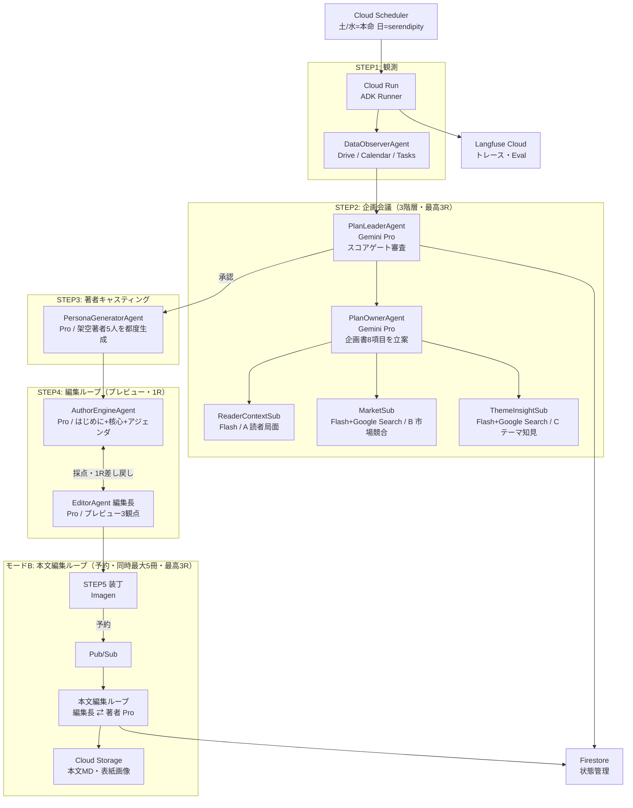

# Publishr — あなた専属の、AI出版社。

> 百万部のベストセラーより、あなたのための一冊。


---

## What is Publishr?

出版社は「最大公約数」しか出せない。あなたの今の状況・関心・悩みにフィットした本は、誰も書いてくれない。

**Publishr** は、あなたの Google Drive・Calendar・Tasks を観測し、「いま何を読むべきか・誰に書かせるべきか」を自律的に判断して、毎週あなた専用の本を出版する AI エージェントシステムです。

| 課題 | Publishr の答え |
|------|----------------|
| 自分の関心は言語化できない | Drive/Calendar 観測で自律推定し企画へ転化 |
| 自分に合った本が見つからない | テーマ×著者スタイルの組み合わせを毎週新生成 |
| 良書を探す時間がない | 毎週、棚に新刊が「入荷」される |

---

## Demo

<!-- TODO: add demo gif (book shelf → reservation → reading) -->

**デモ動画**: <!-- TODO: add link after recording -->

**デモの流れ（30秒）**:
1. 初回登録（業界・職種・関心をタップ式で入力）＋ Google OAuth 同意
2. Cloud Scheduler が自動起動（土曜朝）→ Drive/Calendar を観測し企画3階層会議
3. **翌朝、アプリを開くと棚に新刊が入荷**（本命5冊＋セレンディピティ5冊、各冊に入荷理由付き）
4. 1冊を選んで「予約」→ 執筆完了後に通知 → 本文を読む
5. ハイライト・★評価・著者保存 → 次サイクルの企画へ反映

---

## Why Multi-Agent?

> 「なぜマルチエージェントでなければならないか？」への正直な回答

単一の LLM 呼び出しで「パーソナライズされた良い企画」を出すことは、構造的に2つの理由で不可能です。

### 1. リサーチサブエージェント：外部実データの注入

調査サブ（**B 市場・競合** と **C テーマ知見**）は **Google Search grounding** を使い、「今この瞬間の売れ筋・時事トレンド・業界ニュース」をリアルタイムで取得します。単一 LLM の訓練データは過去のスナップショット。外部検索なしでは「それらしい企画」止まりで、読者の今の状況に刺さる根拠が持てません。

### 2. スコアゲートの差し戻しループ：反復改善

`PlanLeaderAgent` が企画を **4観点×25点（計100点）** でルーブリック採点し、閾値70点未満なら `PlanOwnerAgent` へ差し戻し（最大3ラウンド）。

```
Round 1: score=58 → 差し戻し（relevance が低い、理由付きフィードバック）
Round 2: score=73 → 承認 ✅
```

「自分の出力を自分が採点して突き返す」反復改善は、単一の生成呼び出しでは構造的に実現できません。

---

## Architecture



**エージェント構成まとめ**:

> モデル＝ハイブリッド（判断が重い工程＝Pro／観測寄り＝Flash）。

| エージェント | モデル | 役割 |
|---|---|---|
| DataObserverAgent（ツール） | — | Drive/Calendar/Tasks 観測・要約 |
| ReaderAnalystAgent | Gemini **Pro** | 読者分析（週1・土朝・3層Profile） |
| PlanLeaderAgent | Gemini **Pro** | 企画スコアリング・差し戻し判定（最高3R） |
| PlanOwnerAgent | Gemini **Pro** | 調査3観点を統合し企画書8項目を立案 |
| 調査サブ×3（ReaderContext/Market/ThemeInsight） | Gemini Flash（B・C＋Google Search） | 読者局面・市場競合・テーマ知見の調査 |
| PersonaGeneratorAgent（キャスティング編集者） | Gemini **Pro** | 架空著者5人の都度生成 |
| AuthorEngineAgent | Gemini **Pro** | はじめに＋核心メッセージ＋アジェンダ／本文執筆（人格着せ替え） |
| EditorAgent（編集長） | Gemini **Pro** | プレビュー編集(STEP4・1R)／本文編集(モードB・最高3R)の採点・差し戻し |
| WritingWorker（本文編集ループ） | Gemini **Pro** | 予約された本（同時最大5冊）を編集長⇄著者で約100p執筆 |

---

## Tech Stack

| カテゴリ | 技術 |
|---|---|
| エージェントフレームワーク | Google Agent Development Kit (ADK) |
| LLM | Vertex AI Gemini ハイブリッド（判断が重い工程＝Pro／観測寄り＝Flash） |
| 画像生成 | Vertex AI Imagen（表紙） |
| 実行基盤 | Cloud Run（API・バッチ・執筆ワーカー） |
| スケジューリング | Cloud Scheduler（週3回：土/水/日） |
| イベント駆動 | Pub/Sub（予約→執筆） |
| データベース | Firestore（状態管理・ユーザーデータ） |
| ストレージ | Cloud Storage（本文MD・表紙画像） |
| 認証 | Firebase Auth + Google OAuth（Drive/Calendar/Tasks） |
| 秘密鍵管理 | Secret Manager |
| 可観測性 | Langfuse Cloud（トレース・Eval・スコアログ） |
| CI/CD | GitHub Actions → Cloud Build |
| フロントエンド | <!-- TODO: 選定中 --> |

---

## Features

- 🗓️ **自律企画** — Cloud Scheduler が週3回起動。Drive/Calendar/Tasks を読んで今週の「読むべきテーマ」を自律推定
- 🤖 **3階層の企画会議** — サブ（実データ）→ 担当者（立案）→ リーダー（スコア審査）。70点未満は差し戻し
- ✍️ **著者ペルソナの都度生成** — テーマが決まるたびに架空の著者5人を生成。同テーマの別切り口で5冊を提案
- 📚 **書店メタファーUI** — 「入荷・予約・読む」の自然な動線。入荷理由を付記してAIの判断を可視化
- ⭐ **学習ループ**（C1.8） — 過去本の評価・読了率・いいね/いまいち＋お気に入り著者・読み口を翌サイクルの企画に反映。STEP1読者分析が `readingBehavior`（feedbackSummary/stylePreference/recentReads）へ集約し、STEP2企画が「刺さった軸を強め・不発/既読の被りを避ける」。反応が無い初回は観測ベースのまま（仕組みは `docs/design/agent-io-contract.md §3`）
- 🔒 **マルチユーザー対応** — Firestore ownerUid 分離でユーザー間データを完全分離

---

## Getting Started

### 前提条件

- Python 3.11+
- Node.js 20+（フロントエンド）
- Google Cloud SDK (`gcloud`)
- Google ADK SDK
- GCP プロジェクト（Vertex AI・Firestore・Cloud Run 有効化済み）
- Langfuse Cloud アカウント

### 環境変数

`.env.example` をコピーして `.env` を作成:

```bash
cp .env.example .env
```

```env
# GCP
GCP_PROJECT_ID=your-project-id
VERTEX_AI_REGION=asia-northeast1

# Google OAuth（Drive / Calendar / Tasks）
GOOGLE_OAUTH_CLIENT_ID=your-client-id
GOOGLE_OAUTH_CLIENT_SECRET=your-client-secret

# Langfuse
LANGFUSE_PUBLIC_KEY=your-public-key
LANGFUSE_SECRET_KEY=your-secret-key
LANGFUSE_HOST=https://cloud.langfuse.com
```

> 実値はすべて GCP Secret Manager で管理。ローカル開発時のみ `.env` を使用してください。

### ローカル起動

```bash
# 依存インストール
pip install -r requirements.txt

# ADK 最小動作確認（W1 Hello World）
# TODO: adk run コマンド（友人確認後に追記）

# フロントエンド
cd frontend && npm install && npm run dev
```

#### WSL2 で書店UIをブラウザ確認する（固着回避）

WSL2 では、`next dev`（Turbopack）の開発サーバに対して書店トップ `/` を**初めてブラウザで開いた瞬間**にオンデマンドコンパイルが走り、CPU/メモリを一気に消費して **WSL2 ごとフリーズする**ことがあります。ブラウザで実機確認したい時は、`dev` ではなく **production build**（`/` が静的プリレンダーになりコンパイル不要）で起動してください。

```bash
# 1) BFF（書店データのソース。firestore モードで起動）
DATA_SOURCE=firestore GOOGLE_CLOUD_PROJECT=publishr-498123 \
  uv run --directory apps/api uvicorn publishr_api.main:app --host 127.0.0.1 --port 8000

# 2) Web を production ビルド（NEXT_PUBLIC_* は build 時に client bundle へ焼き込まれるため必ずビルド時に渡す）
NEXT_PUBLIC_DATA_SOURCE=bff NEXT_PUBLIC_API_URL=http://localhost:8000 \
  npm --prefix apps/web run build

# 3) production サーバで配信（→ http://localhost:3000 を開く）
NEXT_PUBLIC_DATA_SOURCE=bff NEXT_PUBLIC_API_URL=http://localhost:8000 \
  npm --prefix apps/web run start
```

- production では `/`（書店トップ）が `○`=静的、動的ルート（`ƒ`、本詳細など）もビルド済みコードの実行のみなので、**回遊しても固まりません**（固着するのは `next dev` の初回 Turbopack コンパイルだけ）。
- `apps/web/next.config.ts` の `output:"standalone"` により `next start` は `does not work with output: standalone` 警告を出しますが、`/`・JSチャンク共に 200 で配信でき**実害はありません**（standalone サーバへ切替不要）。
- 入荷一覧はブラウザが client 側で BFF（`NEXT_PUBLIC_API_URL`/books）を叩いて描画します。`/healthz` が `{"dataSource":"firestore"}`、`/books` が5冊返ることを確認してから開くと確実です。
- 固まらない代替として、デプロイ済み URL を開くのも可: `https://publishr--publishr-498123.asia-east1.hosted.app`

### Cloud Run デプロイ

```bash
# TODO: Cloud Build トリガー設定後に追記
gcloud builds submit --config cloudbuild.yaml
```

---

## CI/CD & Quality Gate

GitHub Actions → Cloud Build のパイプラインに **Eval ゲート** を組み込んでいます。

```
Push to main
  └─ GitHub Actions
       └─ Cloud Build
            ├─ テスト実行
            ├─ Eval Set 8件でスコア評価（LLM-as-judge）
            │    ├─ 観点①: relevance（読者状況との関連度）
            │    ├─ 観点②: differentiation（差別化・新規性）
            │    ├─ 観点③: researchUse（実データの活用度）
            │    └─ 観点④: titleHook（タイトルの魅力）
            ├─ 本命企画の総合スコア < 70 → デプロイ停止 🛑
            └─ スコア ≥ 70 → Cloud Run デプロイ ✅
```

Eval のトレース・スコアログはすべて **Langfuse Cloud** に記録されます。

---

## Roadmap

| Week | 期間 | マイルストーン | ステータス |
|------|------|---------------|------------|
| W0 | 〜6/7 | GCPインフラ構築・設計ドキュメント完成 | ✅ 完了 |
| W1 | 6/8〜6/14 | ADK Hello World・エージェント間疎通確認 | 🔄 進行中 |
| W2 | 6/15〜6/21 | **E2E縦通し1本**（Drive観測→企画→棚入荷） | ⬜ |
| W3 | 6/22〜6/28 | 著者生成・執筆・Firestore状態管理完成 | ⬜ |
| W4 | 6/29〜7/5 | フロントUI・Eval CI組み込み・マルチユーザー | ⬜ |
| W5 | 7/6〜7/8 | デモシナリオ完成・動画収録・ピッチスライド | ⬜ |
| W6 | 7/9〜7/10 | 最終提出・バッファ | ⬜ |

> **最大の技術リスク**: W1 ADK疎通 → W2 E2E縦通し。W2完了で全体の勝負が決まります。

---

## Project Structure

```
00_Publishr/
├── README.md                     ← 本ファイル
├── frontend/                     ← 書店UI（Vite/React・実装着手済）
├── packages/prompts/             ← 各エージェントの完成プロンプト＋良い/悪い出力例（11MD）
├── docs/                         ← 設計・計画・インフラ・UI仕様・ピッチの全ドキュメント
│   ├── 目次.md                   ← 全docインデックス
│   ├── 設計/                     ← 構想/MVP/技術アーキ/IO契約/ADK/API/Firestore/コスト/Langfuse 等（10MD）
│   ├── 計画/                     ← WBS・役割分担/運用・着手チェックリスト・未決論点台帳
│   ├── インフラ/                 ← CICD設計・GCP環境構築ログ
│   ├── UI仕様/                   ← UI仕様書＋モックアップ画像
│   └── ピッチ/                   ← ピッチ原稿・スライド・PDF
└── デモ素材/                     ← Eval/サンプルデータ（fixtures・ドライブ）・デモ台本・著者ペルソナ集
```

設計ドキュメントの詳細は [`docs/目次.md`](docs/目次.md) を参照してください。

---

## License

TBD

---

*Built for DevOps × AI Agent Hackathon 2026*
