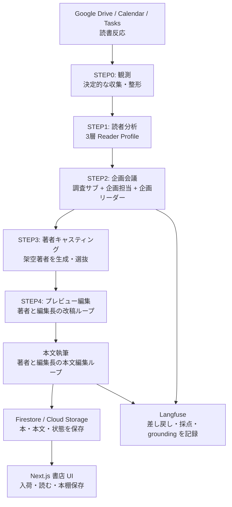

# Publishr

> 百万部のベストセラーより、あなたのための一冊。


Publishr は、ユーザーの Google Drive / Calendar / Tasks と読書反応をもとに、その人だけの本を企画し、著者を立て、本文まで書き上げて書店 UI に届ける AI 出版システムです。

一般的なレコメンドは「既にある本を選ぶ」仕組みです。Publishr は、いまの仕事・関心・課題から「まだ存在しない、その人のための一冊」を生成します。

---

## What Is Publishr?

Publishr は、個人ごとの文脈を読み取り、AI 編集部が本を企画・執筆・配本するプロダクトです。

| 課題 | Publishr の答え |
|---|---|
| 自分の関心や悩みをうまく言語化できない | Drive / Calendar / Tasks から現在の仕事・関心・予定を観測し、読者プロファイルに変換する |
| 既存の本では今の自分に刺さりきらない | 読者文脈、市場・競合、テーマ知見をもとに、その人専用の企画を作る |
| 読む本を探す時間がない | 配本 run ごとに複数テーマを企画し、本文つきの新刊として書店に入荷する |
| 読んだ後の好みが次に活かされない | 評価、読了率、ハイライト、お気に入り著者を次回の読者分析へ戻す |

現行の提出版では、1回の配本 run で複数テーマを企画し、各テーマから1冊ずつ本文まで生成して `published` 状態で届けます。古いオンデマンド執筆 API は後方互換として残っていますが、中心体験ではありません。

---

## How It Works



### Core Loop

1. **観測**: Google Drive の選択フォルダ、Calendar、Tasks を読み、読者の現在地を抽出します。
2. **読者分析**: 基本属性、現在の仕事状況、読書傾向を3層の `ReaderProfile` にまとめます。
3. **企画会議**: 調査サブエージェントが読者文脈・市場・テーマ知見を集め、企画担当が本の企画を作り、企画リーダーがスコアゲートで審査します。
4. **著者キャスティング**: 企画ごとに架空著者を生成・選抜します。お気に入り著者があれば再登板もできます。
5. **編集ループ**: 著者がプレビューと本文を書き、編集長が採点して弱い部分を差し戻します。
6. **配本**: 完成した本を Firestore / Cloud Storage に保存し、書店 UI に入荷理由つきで表示します。

---

## Why Multi-Agent?

Publishr のマルチエージェント性は、単に複数の人格を並べるためではありません。出版プロセスを、責務の違うエージェントに分けるためです。

| 役割 | 担当する判断 |
|---|---|
| Data Observer | Drive / Calendar / Tasks から観測データを集める |
| Reader Analyst | 観測データを読者の現在地・課題・読書傾向へ変換する |
| Research Subs | 読者文脈、市場・競合、テーマ知見を別観点で調査する |
| Plan Owner | 調査結果を統合し、本の企画へ落とし込む |
| Plan Leader | 企画を4観点で採点し、基準未満なら差し戻す |
| Casting Editor | 企画に合う架空著者を生成・選抜する |
| Author | 著者ペルソナをまとってプレビューと本文を書く |
| Editor | プレビューと本文を採点し、弱い章を改稿させる |

この分割により、以下の証跡が残ります。

- 調査サブが実データと検索 grounding を企画に注入する
- 企画リーダーがスコアで却下し、企画担当が再提出する
- 編集長が著者の成果物を採点し、弱い箇所を差し戻す
- すべてのループを Langfuse に記録し、判断過程を後から追える

---

## Features

| 機能 | 内容 |
|---|---|
| Google ソース観測 | Drive の選択フォルダ、Calendar、Tasks から読者文脈を抽出 |
| 3層 Reader Profile | `base` / `currentWork` / `readingBehavior` で読者を表現 |
| セット配本 | 本命・セレンディピティを含む複数テーマを配本 run で企画 |
| スコアゲート | 企画リーダーが relevance / differentiation / researchUse / titleHook を採点 |
| 架空著者生成 | 企画に合わせて voiceStyle と format を持つ著者を生成 |
| 本文編集ループ | 著者と編集長が本文を改稿し、`editRound` と本文を保存 |
| 書店 UI | 入荷理由つきの書店、読書画面、本棚保存、読了フィードバック |
| 30日入荷棚 | 入荷から30日以内の本を新着として表示し、保存した本だけ本棚に残す |
| 読書反応の学習 | 評価、読了率、ハイライト、お気に入り著者を次回の分析に反映 |
| CSS 表紙パレット | 画像生成に依存せず、タイトルが読める表紙を決定的に付与 |
| マルチユーザー分離 | Firebase Auth と Firestore `ownerUid` でユーザーごとのデータを分離 |
| Observability | Langfuse に企画差し戻し、本文編集ループ、grounding URL を記録 |
| Eval Gate | Eval Set を LLM-as-judge で採点し、品質基準を下回る変更を止める |

---

## Tech Stack

| 領域 | 技術 |
|---|---|
| Agent framework | Google Agent Development Kit (ADK) |
| LLM | Vertex AI Gemini Pro / Flash |
| Backend | FastAPI, Cloud Run |
| Frontend | Next.js App Router, React, Firebase App Hosting |
| Data | Firestore, Cloud Storage |
| Auth | Firebase Auth, Google OAuth |
| Queue / Trigger | Pub/Sub, Cloud Scheduler |
| Observability | Langfuse Cloud |
| Quality | pytest, ESLint, TypeScript, custom Eval harness, LLM-as-judge |
| CI/CD | GitHub Actions, Workload Identity Federation, Cloud Run deploy |
| IaC | Terraform for core GCP resources |

表紙の実画像生成用コードは残していますが、提出版の標準経路では CSS 表紙パレットを使います。これにより、ローカル・CI・デモで画像生成コストや失敗に依存せず、安定した書店体験を維持できます。

---

## Local Development

### Prerequisites

- Python 3.12+
- `uv`
- Node.js 22+
- npm

実 Vertex AI、Google OAuth、Firestore を使う場合のみ、GCP プロジェクト、ADC、Firebase、Secret Manager の設定が必要です。既定のローカル経路は mock / fixture ベースで、オフライン・決定的・課金ゼロで動きます。

### Setup

```bash
make setup
```

`make` が使えない環境では、以下を直接実行します。

```bash
uv sync --all-packages --all-extras --dev
npm install
npm --prefix apps/web install
```

### Verify

```bash
make verify
make eval
make eval-gate
```

主な検証コマンド:

| コマンド | 内容 |
|---|---|
| `make verify` | Python テスト、Web lint、TypeScript typecheck |
| `make eval` | mock の Eval harness で企画品質を検査 |
| `make eval-gate` | Eval Set の cases を judge 採点し、基準未満なら失敗 |
| `make eval-gate-vertex` | 実 Gemini judge で Eval gate を実行する課金ありの検証 |
| `make smoke` | ローカル E2E のスモーク確認 |

### Run Locally

```bash
make dev
```

個別に起動する場合:

```bash
make api
make web
```

- API: `http://localhost:8000`
- Web: `http://localhost:3000`

`.env.example` にはローカル実行用の設定例があります。実LLMや実Google連携を使わない限り、秘密情報は不要です。

---

## Quality Gate

`main` への push / pull request では、GitHub Actions が以下を実行します。

```text
make verify
make eval
make eval-gate
```

`make eval-gate` は Eval Set の cases を採点し、基準を満たさない場合に失敗します。プロンプト、Eval、planning 実装に関わる変更では、別 workflow で `make eval-gate-vertex` を実行できるようにしています。

`main` にコード変更が入った場合は、verify と Eval gate を通過した後、Workload Identity Federation で Cloud Run にデプロイします。docs / Markdown のみの変更では、不要な Cloud Run deploy を省略します。

---

## Project Structure

```text
publishr/
├── agents/publishr_agents/       # ADK agents: observe / reader / planning / casting / preview / body
├── apps/api/                     # FastAPI BFF and Cloud Run worker endpoints
├── apps/web/                     # Next.js bookstore UI
├── packages/prompts/             # Prompt files and examples for each agent role
├── packages/shared-schema/       # Shared Pydantic / TypeScript schema and fixtures
├── eval/                         # Eval Set and judge inputs
├── infra/terraform/              # Core GCP infrastructure definitions
└── scripts/                      # Local, eval, smoke, and operations scripts
```

---

*Built for DevOps x AI Agent Hackathon 2026.*
