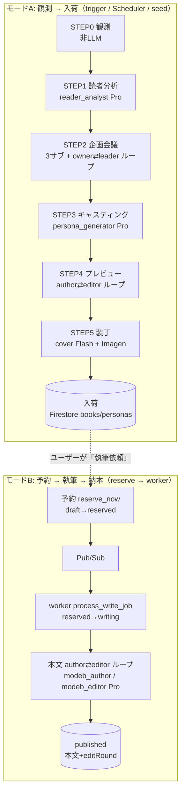
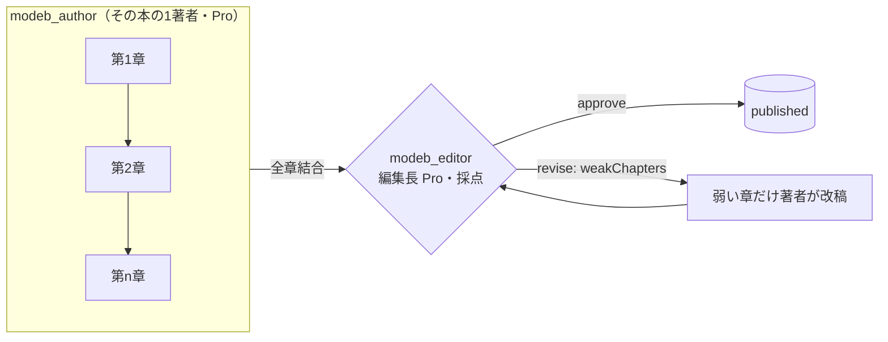

# Publishr エージェント連携設計（フェーズ × Agent × プロンプト × データ）

> どのフェーズで・どのエージェントが・どんなデータから・どんなプロンプトを組み立て・何を次に渡すか。
> 正本コード: `agents/publishr_agents/`（`mode_a.py` / `planning` / `casting` / `preview` / `cover` / `mode_b` / `prompts/registry.py`）。
> プロンプト本文: `packages/prompts/*.md`。状態キー: `agents/publishr_agents/state_keys.py`。

---

## 0. 全体像 — 2つのモード



- **モードA** は「本棚に企画（＝表紙＋ピッチ）を並べる」まで。本文はまだ書かない（プレビュー序文のみ）。
- **モードB** はユーザーが予約した1冊の**本文**を書く（読者が読む唯一の成果物）。
- 2モードとも `PUBLISHR_LLM=mock|vertex` で**同じ構造のまま**実LLM/決定的mockを切替（→ §1）。

---

## 1. 共通の仕組み（シーム）

### 1.1 ディスパッチャ（mock / vertex）
各フェーズは `llm="mock"|"vertex"` で実装を切替える。**mock=決定的キャンド出力（LLM未使用・$0）**、**vertex=実Gemini（ADK経由）**。
例）`mode_b/__init__.py: write_body_loop()` が `llm=="vertex"` で `run_body_loop_vertex` に委譲。
`mode_a.py` は `reader_llm / llm / preview_llm / cover_llm` を**段階別に**切替可（コスト制御）。

### 1.2 モデル割当（Pro / Flash ハイブリッド） — `llm/provider.py: model_for(role)`
| tier | 使うrole | 方針 |
|---|---|---|
| **Pro**（`gemini-2.5-pro`） | reader_analyst / plan_owner / plan_leader / persona_generator / author_preview / editor_preview / modeb_author / modeb_editor / eval_judge | 判断・執筆が重い工程 |
| **Flash**（`gemini-2.5-flash`） | sub_reader_context / sub_market / sub_theme_insight / cover | 観測・調査・補助寄り |

### 1.3 プロンプトの組み立て — `prompts/registry.py` + `prompts/render.py`
役割（role）ごとに**何を読み・何を出すか**を1か所に集約（`REGISTRY`）。プロンプトは2部構成で動的生成する。

```
最終プロンプト =
  build_system_text(role, state)            # ① packages/prompts/{prompt_file}.md の system 本文
    └ + 採点系なら「# 参考出力例」に good_example を添付（few-shot 常時ON）
  + "\n\n# 入力\n"
  + render_template(INPUTS_TEMPLATE, state)  # ② {{var}}/{{a.b}} を state の値で差し込む
```

- `build_system_text`（`render.py:72`）= プロンプトファイルの「## 完成プロンプト（system）」を抽出し、**採点系（leader/editor×2/judge）は few-shot を常時ON**で添付。
- `render_template`（`render.py:60`）= `{{readerProfile}}` `{{targetChapter}}` などを**state（camelCase）**から差し込む。
- few-shot規律: `StepSpec.is_scoring / fewshot_always_on`（採点系=常時／生成系=`PROMPT_FEWSHOT`依存）。

### 1.4 フェーズ間で渡すデータ（state キー） — `state_keys.py`
```
observation → reader_profile → (subReaderContext / subMarket / subThemeInsight)
            → planDraft → leaderVerdict / rejectionFeedback → approvedPlan
            → generatedPersonaSet → (BookDraft) → editorVerdict → cover → books
```
値は **camelCase**で、プロンプトの `{{var}}` 名と一致させる（`adk-control-flow.md §4`）。

---

## 2. モードA フェーズ詳細

オーケストレーション本体: `mode_a.py: run_mode_a_pipeline()`（observe→reader→planning→casting→preview→cover）。

### レジストリ早見表（`prompts/registry.py`）
| STEP | role | model | プロンプト(`packages/prompts/`) | 入力（主なstate/データ） | 出力スキーマ → state |
|---|---|---|---|---|---|
| 1 | `reader_analyst` | Pro | `step1_reader_analyst.md` | ObservationBundle | `ReaderProfile3Layer` → `reader_profile` |
| 2a | `sub_reader_context` | Flash | `step2_research_subs.md` | readerProfile | `SubReaderContext` → `subReaderContext` |
| 2a | `sub_market` | Flash(🔎grounding) | `step2_research_subs.md` | readerProfile/theme | `SubMarket` → `subMarket` |
| 2a | `sub_theme_insight` | Flash(🔎grounding) | `step2_research_subs.md` | theme | `SubThemeInsight` → `subThemeInsight` |
| 2b | `plan_owner` | Pro | `step2_plan_owner.md` | readerProfile + 3サブ + rejectionFeedback | `PlanProposal` → `planDraft` |
| 2c | `plan_leader` | Pro(採点) | `step2_plan_leader.md` | planDraft + 3サブ | `LeaderVerdict` → `leaderVerdict` |
| 3 | `persona_generator` | Pro | `step3_casting_editor.md` | approvedPlan + readerProfile + 好み著者 | `GeneratedPersonaSet`(5著者) → `generatedPersonaSet` |
| 4a | `author_preview` | Pro | `step4_author_preview.md` | plan + persona + readerProfile | `BookDraft`(7項目ピッチ) |
| 4b | `editor_preview` | Pro(採点) | `step4_editor_preview.md` | BookDraft + readerProfile | `EditorVerdict` → `editorVerdict` |
| 5 | `cover` | Flash | `step5_cover.md` | BookDraft（title/coreMessage） | coverPrompt（→ Imagen で画像化・任意） |

### STEP0 観測（observe）— **非LLM**
`observe/collect_observation(user, now, source)`。`source` は `FixtureObservationSource`（mock）/ `GoogleObservationSource`（実: Calendar+Tasks）。
Drive/Calendar/Tasks 等の生メモ → 型付き `ObservationBundle`（signals/evidence）に整形。**ここはプロンプト無し**（決定的収集）。

### STEP1 読者分析（reader）
`reader_analyst`(Pro)。ObservationBundle を**3層プロファイル**（base / currentWork / readingBehavior）に推定 → `ReaderProfile3Layer`。
これ以降の全フェーズが「この読者一人」に最適化する基準点になる。

**学習ループ（C1.8）**: ユーザの過去公開本の反応（評価/読了率/いいね・いまいち=readingReaction）＋選択（お気に入り作家・読み口・既読）を `reader/preferences.py` で集約し、`readingBehavior`（`feedbackSummary`/`stylePreference`/`recentReads`）へ反映する。STEP2 はこの `readerProfile` を受け取るため、**刺さった軸を強め・不発/既読の被りを避ける**企画に向かう。反応が無ければ readingBehavior は空＝従来どおり観測ベース（mock決定的は不変）。入力は `run_mode_a_pipeline(past_books=…)`、BFF は published（反応あり・owner一致）本を渡す。

### STEP2 企画会議（planning）= **必然性ループ①**
構造（vertex）: `Sequential[ Parallel[3サブ] → Loop[ owner → leader → (approve?break : reject→再提出) ] ]`。
1. **調査3サブ（並列・Flash）**: `sub_market`/`sub_theme_insight` は **google_search で grounding**（売れ筋・marketGap・テーマ知見）、`sub_reader_context` は読者文脈を補完。
2. **企画オーナー** `plan_owner`(Pro): 3サブを材料に企画(`PlanProposal`)を起案。差し戻し時は `rejectionFeedback` を受けて練り直す。
3. **企画リーダー** `plan_leader`(Pro・採点): 4観点で採点し `LeaderVerdict`(approve/reject + feedback)。**rejectなら却下理由を owner に戻して再提出**（`reject_log` に証跡）。approve で `approvedPlan` 確定。

### STEP3 キャスティング（casting）
`persona_generator`(Pro)。承認企画＋読者プロファイルから、その企画に最適な**架空著者5人**を生成（`GeneratedPersonaSet`）。
著者は **voiceStyle × format の2軸**で差別化（例: 現場叩き上げ型 / 東洋思想型 …）。

### STEP4 プレビュー（preview）= **必然性ループ②（プレビュー版・最高1R）**
著者ごとに:
1. **著者** `author_preview`(Pro): `BookDraft`（タイトル/サブ/序文サンプル/アジェンダ等 7項目のピッチ）を執筆。
2. **編集長** `editor_preview`(Pro・採点): `EditorVerdict` で採点 → 弱ければ `editorFeedback` を返し著者が改稿（最高1R）。

### STEP5 装丁（cover）
`cover`(Flash) が `coverPrompt`（テキスト）を生成 → `ENABLE_IMAGEN=1` のとき **Imagen**（`imagen-3.0`・3:4）で表紙画像を生成。mock は CSS バリアント装丁。

### 入荷（arrivals）
`BookDraft`＋装丁 → shared-schema の `Book`/`Persona` に**マッピング**して Firestore（`books`/`personas`）へ upsert。書店UIに「入荷理由つき」で並ぶ。

---

## 3. モードB 本文ループ（reserve → worker）= **必然性ループ③**

本体: `mode_b/vertex_agent.py: run_body_loop_vertex_async()`。著者と編集長は**別ロール**（同一人格ではない）。



- **著者** `modeb_author`(Pro): **1冊につき1人**（割当ペルソナ）が**全章を順に**書く（章ごとに著者は替わらない）。
  入力state: `bookDraft`(agenda) / `persona` / `readerProfile` / `targetChapter` / `prevChapterSummary` / `editorFeedback`(改稿時) / `targetChars`（`PUBLISHR_BODY_CHARS_PER_CHAPTER`）。
- **編集長** `modeb_editor`(Pro・採点): **別人格**。本文を**5観点**（coherence / hook / relevance / persona_consistency / actionability）で採点 → `BodyVerdict`。
  `revise` の間、**弱い章だけ**（`weakChapters`）著者が改稿→再採点を**最高 `PUBLISHR_BODY_EDIT_ROUNDS` 回**。`editRound` に到達ラウンドを記録（=差し戻し証跡）。
- 章数 = `book.agenda[:PUBLISHR_BODY_MAX_CHAPTERS]`、各章の分量は `targetChars` のソフトヒント（§ページ数の決め方は本文文字数の概算）。
- 実行は `worker`（Pub/Sub push）から `process_write_job`→`write_body_loop(llm=vertex)`。コスト規律のためデプロイ既定は mock。

---

## 4. 「必然性」を見せる3つの対立ループ（証跡）
| # | フェーズ | 対立 | 証跡 |
|---|---|---|---|
| ① | STEP2 企画 | 企画オーナー ⇄ **企画リーダー**（採点・却下→再提出） | `reject_log` / `verdictHistory` |
| ② | STEP4 プレビュー | 著者 ⇄ **編集長**（採点・改稿） | `editorVerdict` |
| ③ | モードB 本文 | 著者 ⇄ **編集長**（5観点・弱章差し戻し） | `verdicts` / `editRound` / `revisedChapters` |
| 調査 | STEP2 サブ | google_search **grounding** | 取得URL（`observability.grounding_urls_from_events`） |

計装: `observability.trace_pipeline()` が①②③＋grounding URL を Langfuse で可視化（C5.6）。

---

## 5. Eval ゲート（CI 品質）
`eval_judge`(Pro)。`eval/eval_set.yaml` の企画ケースを採点し、`expectedBand` 整合を CI ゲート（7/8通過）に使う。
オフラインは決定的 mock judge（`scripts/eval_gate.py`・4観点×0-25）、本番は GEAP（Vertex判定）。

---

## 6. 補足
- ADK 実行は `InMemoryRunner.run_async`（`vertex_agent.py`）。`output_schema` 指定のロール（採点系/生成系）は構造化出力を強制。
- 実LLM呼び出しは `llm/resilience.py` の retry/timeout でラップ（transientのみ指数バックオフ・C5.9）。
- mock 経路は本書のエージェントを**使わない**（決定的キャンド出力）。差分ゼロを保つのが移行規律。
- 関連設計: `docs/design/adk-control-flow.md`（制御フロー詳細）/ `packages/prompts/README.md`（few-shot規律）。
