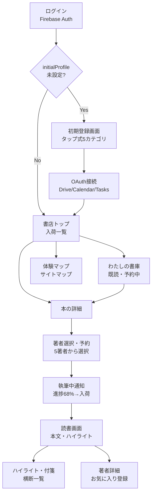

# Publishr UI仕様書

> 📑 全体の目次・真実源マップは [正本マップ](../README.md)／未確定論点は [open-issues.md](../planning/open-issues.md)。
> **モックアップ画像**: `モックアップ画像/`（8枚・同フォルダ内）を参照。
> **位置づけ**: フロントエンド実装（鉄田 × Claude Code）の直接前提。画面・コンポーネント・Firestoreフィールド・遷移を1枚に統合した実装仕様書。

---

## 0. 前提・スコープ

### 実装担当
- フロント全般：**鉄田（Claude Code）**
- API実装（reserve・OAuth・手動trigger）：**友人**
- Firestoreスキーマ（Source of Truth）：`技術アーキテクチャ.md §3`

### MVP UI対象（IN）
| # | 機能 | DoD |
|---|---|---|
| 0 | 初期プロフィール入力 | initialProfile がFirestoreに保存されること |
| 1 | OAuth接続（3ソース） | Drive/Calendar/Tasks の接続状態が表示されること |
| 4 | 書店トップ（入荷一覧） | draftステータスの本が表示され、入荷理由が読めること |
| 5 | わたしの書庫 | 予約中・読書中・読了を横断して一覧できること |
| 6 | 本の詳細 | 企画情報・序文サンプルが読め、著者選択に進めること |
| 7 | 著者選択・予約 | 著者5人から選択し予約できること |
| 8 | 執筆中通知 | 執筆進捗が視覚化され、入荷時に遷移できること |
| 9 | 読書 | 本文を読み、ハイライト・FBができること |
| 10 | ハイライト・付箋 | 全書籍横断でハイライトを閲覧できること |
| 11 | 著者詳細 | お気に入り登録（Firestore直書き）ができること |

### MVP UI対象外（OUT）
- モバイル対応（TODO）
- initialProfile の変更画面（MVPは不可・Drive観測で次サイクル自然更新）
- 読者分析・プロフィールの可視化画面
- マルチユーザー管理画面（インフラは対応済み・デモは1ユーザー）

### フロントライブラリ
> 🔴 **TODO（G1-11）**: フレームワーク・UIライブラリ未選定。`技術アーキテクチャ.md §2` では「Next.js or Firebase Hosting」。W1で鉄田が決定。本書はフレームワーク非依存の表記とする。

---

## 1. 体験フロー（全体像）



**app-map.png のフロー区分**:
| フェーズ | 説明 |
|---|---|
| 観測 | Drive/Calendar/Tasks からデータ取得（バックエンド・週1回） |
| 企画判断 | 3階層エージェント会議→スコアゲート→企画確定 |
| 選書 | ユーザーが棚から1冊を選ぶ |
| 学習 | ハイライト・FB・お気に入り著者が次の企画に反映 |

---

## 2. レイアウト原則・デザインシステム

### 2-1. 全体レイアウト（デスクトップ優先）

モックアップ（全8枚）から確定したレイアウト構造：

```
┌──────────────────────────────────────────────────────┐
│ Left Sidebar (240px固定)  │ Main Content              │ Right Panel（読書時のみ・280px）
│                           │                            │
│ Publishrロゴ              │ ページ別コンテンツ         │ このページの作業
│ キャッチコピー            │                            │ ハイライト・付箋操作
│                           │                            │ ★評価・FB
│ ナビメニュー              │                            │ このページのひびき
│  ─ あなたの書店           │                            │
│  ─ わたしの書庫           │                            │
│  ─ ハイライト・付箋       │                            │
│  ─ 著者の作家たち         │                            │
│  ─ サイトマップ           │                            │
│                           │                            │
│ [直近の本 3冊]            │                            │
│                           │                            │
│ ユーザー名・役職          │                            │
└──────────────────────────────────────────────────────┘
```

- Right Panel は読書画面（§3-9）でのみ表示。他の画面では非表示。
- モバイル対応はMVP対象外（TODO）。

### 2-2. ビジュアルデザイン（高級書店テーマ）

モックアップから確定した指針：

| 要素 | 指針 |
|---|---|
| 背景色 | 黒〜ダークグレー（深みのある暗色） |
| テキスト | ゴールド〜クリーム系（高コントラスト） |
| 表紙カード | ダークトーングラデーション（深緑・ネイビー・焦茶） |
| 雰囲気 | プレミアム書店・ラグジュアリー・落ち着き |
| フォント | 読書体験を意識した可読性重視（セリフ系or可読性高サンセリフ） |

### 2-3. 共通コンポーネント

| コンポーネント | 説明 | 使用画面 |
|---|---|---|
| **BookCard** | 表紙・タイトル・著者名・StatusBadge・入荷理由（折り畳み） | 書店トップ・書庫 |
| **StatusBadge** | draft=入荷 / reserved=予約中 / writing=執筆中 / published=既読 | BookCard内・本詳細 |
| **AuthorChip** | 著者名・スタイルタグ・お気に入りアイコン | 著者選択・著者詳細 |
| **ProgressBar** | 執筆進捗（0〜100%） | 執筆中通知 |
| **HighlightItem** | ハイライトテキスト・書籍名・著者名・タグ | ハイライト一覧 |
| **Sidebar** | ナビ・直近本・ユーザー情報（全画面固定） | 全画面 |

### 2-4. Firestoreリアルタイム購読の基本方針（`API契約仕様.md §1` 準拠）

| 操作 | 方式 |
|---|---|
| 棚一覧・本詳細・読書メタの読み取り | **Firestoreリアルタイム購読（onSnapshot）** |
| ハイライト・FB・★の保存 | **Firestore直書き** |
| initialProfile保存・favoriteAuthors操作 | **Firestore直書き** |
| 予約 | `POST /api/reserve`（Cloud Run）|
| OAuth連携 | `GET /api/auth/google/*`（Cloud Run）|
| 手動トリガー（デモ用） | `POST /api/trigger/planning`（Cloud Run）|

---

## 3. 画面別仕様

---

### 3-0. 体験マップ

**モックアップ**: `app-map.png`
**目的**: Publishrの全体体験フローをユーザーが理解できる案内ページ

**表示内容**（app-map.pngより）:
- 見出し: "Publishr 体験の地図"
- 体験フロー: 観測 → 企画判断 → 選書 → 学習
- 各フェーズのサマリー説明
- 右側: 各画面へのナビゲーションカード（書店トップ・本の詳細・読書・執筆中・著者・ハイライト）

**アクション**: 各カードクリック → 対応画面へ遷移

**表示条件**: サイドバーの「サイトマップ」からアクセス

---

### 3-1. ログイン

**モックアップ**: なし（デザインはシンプルで可）
**目的**: Firebase Auth によるGoogle Sign-In

**表示内容**:
- Publishrロゴ・キャッチコピー（百万部のベストセラーより、あなたのための一冊。）
- Googleでログインボタン

**アクション**:
- Googleでログイン → Firebase Auth処理 → `users/{uid}.initialProfile` の有無を確認
  - 未設定 → 初期登録画面（3-2）
  - 設定済み → 書店トップ（3-4）

**Firestore/API**: Firebase Auth SDK（`signInWithPopup`）

---

### 3-2. 初期登録（initialProfile入力）

**モックアップ**: なし（設計は以下から作成）
**目的**: ユーザーの業界・職種・役職・関心・読書傾向を登録。Publishrの企画精度の初期値となる。

**レイアウト**:
- ステッパー（1/5〜5/5）でカテゴリを1つずつ表示
- 各ステップ: 質問文 + 選択肢タップ（テキスト入力なし）
- 最終ステップ: 確認 + 「登録する」ボタン
- フッター: 「スキップする」リンク（`skipped:true` 保存）

**カテゴリ別選択肢**（W1で最終確定 → 🔴 G1-9）:

| ステップ | カテゴリ | タイプ | 選択肢 |
|---|---|---|---|
| 1/5 | ①業界 | 単一選択・必須 | 食品・飲料／日用品・化粧品（消費財）／製造・メーカー（その他）／小売・流通／IT・ソフトウェア／金融・保険／コンサル・専門サービス／商社／医療・製薬・ヘルスケア／建設・不動産／広告・メディア・エンタメ／公共・教育・非営利／その他 |
| 2/5 | ②職種 | 単一選択・必須 | マーケティング・ブランド／営業・セールス／企画・経営企画／商品開発・R&D／生産・製造・品質／人事・総務／経理・財務／情報システム・IT／コンサルタント／経営・役員／その他 |
| 3/5 | ③役職 | 単一選択・必須 | メンバー・担当／チームリーダー・主任／課長・マネージャー／部長・シニアマネージャー／本部長・事業部長／役員・経営層／個人事業・フリーランス |
| 4/5 | ④最近の関心 | 複数選択・最低1つ必須 | 新任マネジメント・チームづくり／メンバー育成・1on1／評価・フィードバック／リーダーシップ／戦略・事業計画／マーケティング・ブランディング／ロジカルシンキング・問題解決／数字・データ活用／業務効率化・生産性／AI・生成AIの活用／組織変革・カルチャー／キャリア・自己成長／プレゼン・伝える力／会議・ファシリテーション／モチベーション・メンタル／イノベーション・新規事業／顧客理解・CX／時間管理・段取り／交渉・調整 |
| 5/5 | ⑤読書傾向 | 複数選択 | ビジネス実務／戦略・経営／自己啓発／教養・リベラルアーツ／小説・物語／ほぼ読まない |

**アクション**:
- 「登録する」→ Firestore直書き `users/{uid}.initialProfile` → OAuth接続画面（3-3）
- 「スキップ」→ `{ skipped: true }` 保存 → OAuth接続画面（3-3）

**Firestore書き込み先**（`API契約仕様.md §2-a`）:
```
users/{uid}.initialProfile {
  industry, jobType, position,
  recentInterests[], readingGenres[],
  createdAt: ISO8601, skipped: false
}
```

> 🟡 初回create のみ許可（変更は MVPでは不可）。セキュリティルール参照: `Firestoreセキュリティルール.md §3`

---

### 3-3. OAuth接続

**モックアップ**: なし（シンプルで可）
**目的**: Drive / Calendar / Tasks の観測権限を同意取得する

**表示内容**:
- 接続する3ソースの説明（何のデータを・なぜ使うか）
  - Google Drive: 業務資料・関心フォルダのテキスト（**Google Picker でフォルダ単位選択**・G1-13確定）
  - Google Calendar: スケジュール・役割文脈
  - Google Tasks: タスクリスト・優先度文脈
- 「Googleアカウントで連携する」ボタン
- **Drive フォルダ選択（Google Picker）**ボタン＝観測対象フォルダをユーザーが選ぶ（drive.fileは走査不可のため／G1-13＝MTG 2026-06-05確定・フォルダ単位）
- 各ソースの接続状態（✅ / ⬜）

**アクション**:
- 「連携する」→ `GET /api/auth/google/start` → Google OAuth同意画面
- 「Drive フォルダを選ぶ」→ Google Picker（フォルダ単位）→ 選択フォルダを `connectedSources.drive.folderIds[]` に保存
- OAuth完了 → `GET /api/auth/google/callback` → 書店トップ（3-4）

**Firestore読み取り**（接続状態確認）:
```
users/{uid}.connectedSources.{drive,calendar,tasks}.enabled
```

**API**:
- `GET /api/auth/google/start` → `{ authUrl }` を受け取りリダイレクト
- `GET /api/auth/google/callback` → サーバ処理後に設定完了画面へリダイレクト

---

### 3-4. 書店トップ（あなたの書店）

**モックアップ**: `index.png`
**目的**: Publishrが自律的に「入荷」した本を一覧表示。自律性の体験の核心。

**レイアウト**（index.pngより）:
```
見出し: "今朝、あなたの書店に新しい本が並びました。"

[今週の入荷] ─────────────────────────
  BookCard × 最大10冊（本命5 + serendipity5）
  各カードに: 表紙・タイトル・著者・themeKind バッジ・入荷理由

[予約中] ──────────────────────────────
  reserved ステータスの本カード

[見読み（既読）] ──────────────────────
  published ステータスの本カード
```

**表示するFirestoreフィールド**（`books/` ownerUid一致）:
| フィールド | 表示場所 |
|---|---|
| `title` | BookCardタイトル |
| `coverUrl` (GCS) | BookCard表紙画像 |
| `status` | StatusBadge |
| `themeKind` | 本命 / セレンディピティ バッジ |
| `authorPersonaId` / `plans.reason` | 入荷理由テキスト（「なぜこの本がおすすめか」） |
| `prefaceSample` | カードホバー or 折り畳み（省略可） |

**Firestoreクエリ**:
```
// 今週の入荷（draft）
collection("books").where("ownerUid","==",uid).where("status","==","draft")

// 予約中
collection("books").where("ownerUid","==",uid).where("status","==","reserved")

// 既読
collection("books").where("ownerUid","==",uid).where("status","==","published")
```

**アクション**:
- BookCardクリック → 本の詳細（3-6）
- ヘッダーの「デモ用トリガー」（管理者のみ）→ 手動トリガー（3-4補足）

**補足（デモ用手動トリガー）**:
- `POST /api/trigger/planning` を呼び出すボタン（デモ専用・通常は非表示または管理者限定）
- Response: `202 Accepted` → フロントはFirestore購読で「入荷」を検知

---

### 3-5. わたしの書庫

**モックアップ**: `library.png`
**目的**: ユーザーが読んだ・予約した本の一覧と統計。

**レイアウト**（library.pngより）:
```
見出し: "わたしの書庫"
キャッチ: "あなたのために書かれた本が、ここに増えていきます。"

[統計バー]
  9冊 / 6本 / 4点 / 37ハイライト
  （総冊数 / 読了 / 平均★ / ハイライト数）

[フィルタータブ]
  すべて / 読書中 / 読了 / 積読先 / 安矢先 / 校談文庫 / 七柱文庫
  ※ themeKind別・著者スタイル別フィルタも含む（TODO: 最終タブ構成）

[BookCardグリッド]
  ─ 各カード: 表紙・タイトル・著者・ジャンルタグ・★・status
```

**表示するFirestoreフィールド**:
| フィールド | 表示場所 |
|---|---|
| `title`, `coverUrl` | BookCard |
| `status` | StatusBadge・タブフィルタ |
| `themeKind` | タグ |
| `feedback.rating` | ★表示 |
| `feedback.read%` | 進捗バー（読書中のみ） |

**統計計算**（クライアントサイド）:
- 総冊数: `books.where("ownerUid","==",uid)` の count
- 読了: `status=="published"` の count
- ハイライト: `users/{uid}.readingFB.highlights.length`

**アクション**:
- フィルタータブ切替 → クエリ変更
- BookCardクリック → 本の詳細（3-6）

---

### 3-6. 本の詳細

**モックアップ**: `book-detail.png`
**目的**: 1冊の企画情報・序文サンプル・目次を確認し、著者を選んで予約する。

**レイアウト**（book-detail.pngより）:
> ★この画面は「**著者版（books/{bookId}）1冊**」の詳細。表示はすべて **BookDraft 7フィールド（著者が生成）** を使う（plansではなくbooksが正＝著者の声で書かれた文面を見せる）。
```
上部ラベル: "Today's arrival - carved for you"

[左カラム: 表紙 + あなたへの文脈]
  ─ タイトル / サブタイトル: books.title / books.subtitle
  ─ 今、あなたは: books.deliveryReason（入荷理由＋観測ソース）
  ─ 解決する課題: books.problemToSolve
  ─ 核心メッセージ: books.coreMessage
  ─ CTA: 「この本を予約する」→ 予約（最大5冊チェック・3-7）

[右カラム: タブ切替]
  ─ タブ: アジェンダ（目次） / 序文サンプル
  ─ 目次リスト: books.agenda[]（章タイトル＋一行サマリー）
  ─ 序文サンプル: books.prefaceSample（カード形式）
```

**表示するFirestoreフィールド（BookDraft 7フィールド・すべて `books/{bookId}`）**:
| フィールド | 表示場所 |
|---|---|
| `title` / `subtitle` | タイトル・サブタイトル |
| `deliveryReason` | 「今、あなたは」（入荷理由＋観測ソース・F3） |
| `problemToSolve` | 「解決する課題」 |
| `coreMessage` | 「核心メッセージ」 |
| `agenda[]` | 目次タブ（章＋一行サマリー） |
| `prefaceSample` | 序文サンプルタブ |
| `coverUrl` / `authorPersonaId` | 表紙・著者リンク |
> ※ plans の reason/readerSituation 等は企画段階の素材。詳細画面は著者がそれを翻案した books の7フィールドを正とする。

**アクション**:
- 「著者を選んで予約」ボタン → 著者選択（3-7）
- 著者名クリック → 著者詳細（3-11）

---

### 3-7. 著者選択・予約

**モックアップ**: `book-detail.png`（下部の著者5人選択UI）
**目的**: 同一企画×5著者のカードを比較し、1冊を選んで予約する。

**レイアウト**:
```
見出し: "著者を選ぶ"
説明: "同じテーマを5人の著者が、それぞれの文体で書きます。"

[著者カード × 5]
  ─ 著者名・スタイルタグ・序文の出だし（1段落）
  ─ 「この著者版を予約する」ボタン

（著者詳細リンク → 3-11 でプロフィール確認可能）
```

**表示するFirestoreフィールド**:
| コレクション | フィールド | 表示場所 |
|---|---|---|
| `personas/{personaId}` | `name`, `voiceStyle`, `format` | 著者カード（文体軸＋形式のタグ） |
| `personas/{personaId}` | `persona` (経歴・口癖・思想) | 著者カード詳細 |
| `books/{bookId}` | `prefaceSample` | 各著者版の序文サンプル |

**アクション**:
- 著者選択 → 「予約する」ボタン → `POST /api/reserve` 呼び出し
  - Request: `{ "bookId": "..." }`
  - Response: `{ "bookId": "...", "status": "reserved" }`
  - → 執筆中通知（3-8）へ遷移
- **★予約上限（同時5冊）のクライアント側ガード**: 現在 `status in (reserved, writing)` の本が**5冊以上**なら、予約ボタンを非活性化し「予約中の本が5冊あります。読み終えるまでお待ちください」を表示（サーバも `POST /api/reserve` で409を返す＝二重ガード／I-16）。

---

### 3-8. 執筆中通知

**モックアップ**: `writing.png`
**目的**: 執筆進捗を可視化し、完成通知を受け取る。

**レイアウト**（writing.pngより）:
```
見出し: "あなたの一冊を、執筆中です。"
説明: "あなたが選んだ著者・専属の編集部が動き出しました。完成まで..."

[左: 本の表紙 + 著者名 + 進捗バー（68%）]
  著者◯◯が執筆しています── 68%

[右: 工程ステップ表示]
  ① 観測（完了）
  ② 読者分析（完了）
  ③ 企画会議（完了 / 3フレームワーク等）
  ④ 著者の選出（完了）
  ⑤ 執筆（進行中）
  ⑥ 校正（待機中）
  ⑦ 納本（待機中）

[下部通知バナー（入荷後に表示）]
  「◯◯が入荷しました」[今すぐ読む →]
```

**Firestoreリアルタイム購読**:
```
// books/{bookId}.status を onSnapshot で監視
// writing → published に変化したら通知バナーを表示
```

**表示するFirestoreフィールド**:
| フィールド | 表示場所 |
|---|---|
| `books.status` | 工程ステップ（writing / published） |
| `books.title`, `books.coverUrl` | 表紙・タイトル |
| `personas.name` | 著者名 |
| `books.writingProgress`（仮・TODO） | 進捗バー % ← **要友人確認: このフィールドをバックが書くか** |

**アクション**:
- 「今すぐ読む」バナークリック → 読書画面（3-9）

---

### 3-9. 読書画面

**モックアップ**: `reader.png`
**目的**: 本文を読む。ハイライト・付箋・簡易FBを行う。

**レイアウト**（reader.pngより）:
```
上部ブレッドクラム: 書庫 > 本のタイトル > 著者名

[中央: 本文エリア（縦スクロール）]
  ─ Chapter表示
  ─ 本文テキスト
  ─ ハイライト可能（テキスト選択 → ハイライトメニュー表示）

[右パネル（固定280px）]
  ─ このページの作業
    - ハイライト（選択した文章をマーキング）
    - 付箋（メモ追記）
  ─ 読みながら、ひとこと（★まず役に立った等）
    - ★まず役に立った
    - 参考になった
    - 難しかった
    - 後で読み返す
  ─ このページのひびき（AIが抽出した要点）

[上部右: 表示設定]
  フル / 標準 / 前の / ここだ / Aa（フォントサイズ）
```

**Firestoreデータアクセス**:

読み取り（GCSから本文MD取得）:
```
// books/{bookId}.bodyUrl → Cloud Storage からMarkdown取得
fetch(books.bodyUrl) → レンダリング
```

ハイライト保存（Firestore直書き）:
```
users/{uid}.readingFB.highlights[] に追加:
{
  bookId, text: "選択テキスト",
  chapter, page,
  note: "任意メモ",
  savedAt: ISO8601
}
```

簡易FB保存（Firestore直書き）:
```
books/{bookId}.feedback を更新:
{
  rating: 1-5,
  dropped: bool,
  read: "0-100%",
  wantsSequel: bool
}
```

**アクション**:
- テキスト選択 → ハイライトメニュー → 右パネルに追加・Firestore保存
- ★タップ → `books.feedback.rating` 更新
- 「読了」ボタン → `books.feedback.dropped=false, read="100%"` 保存 → 著者詳細へ誘導
- 「離脱」ボタン → `books.feedback.dropped=true` 保存
- 著者名クリック → 著者詳細（3-11）

---

### 3-10. ハイライト・付箋

**モックアップ**: `highlights.png`
**目的**: 全書籍横断のハイライト・付箋・ブックマークを一覧表示。学習シグナルの可視化。

**レイアウト**（highlights.pngより）:
```
見出し: "ハイライトと付箋"
説明: "あなたが線を引いた場所・付箋を貼った場所——これはあなたの関心の地図です。"

[フィルタータブ]
  すべて 20 / ハイライト / 付箋 / ブックマーク

[ハイライトリスト（左3/4）]
  ─ 書籍名セクション見出し
  ─ HighlightItem: テキスト・章・著者・タグ

[右パネル（1/4）]
  ─ テーマ分類（キーワードタグクラウド）
  ─ 著者分類（どの著者のハイライトが多いか）
```

**表示するFirestoreフィールド**:
```
users/{uid}.readingFB.highlights[] の全件
  ─ 書籍別にグルーピング（books/{bookId}.title で表示）
  ─ テーマタグは クライアントサイドで分類 or Langfuse連携（TODO）
```

**アクション**:
- HighlightItemクリック → 該当の読書画面（3-9）の該当箇所へジャンプ
- 書籍名クリック → 本の詳細（3-6）

---

### 3-11. 著者詳細・お気に入り登録

**モックアップ**: `author.png`
**目的**: 著者の人格・スタイルを確認し、お気に入りに登録する。

**レイアウト**（author.pngより）:
```
ブレッドクラム: あなたの書庫 > 著者プロフィール

[上部: 著者ヘッダー]
  ─ 丸アイコン（漢字1文字）
  ─ 著者名（例: 霧島 玄）
  ─ スタイルタグ（例: 実践派 / 教育者 / 投資家・マーケッター）
  ─ ☆お気に入りの作家に登録 ボタン（登録済みは★・済みバッジ）
  ─ この著者の本 n冊 / ハイライト n個

[この作家の人格（4カード）]
  ─ 背景（経歴・専門性）
  ─ 文体（書き方の特徴）
  ─ 思想（世界観・信念）
  ─ 専門・投資テーマ（personas.expertise[]）

[著者名言（Quote）]
  ─ 印象的な一節

[あなたに（この著者の既読本）]
  ─ books[] のこの著者分（BookCard × 最大3冊）

[下部CTA]
  ─ 次の本を選ぶ → 書店トップ（3-4）
```

**表示するFirestoreフィールド**:
| コレクション | フィールド | 表示場所 |
|---|---|---|
| `personas/{personaId}` | `name`, `style` | ヘッダー |
| `personas/{personaId}` | `persona`（経歴・口癖・思想） | 人格カード |
| `personas/{personaId}` | `expertise[]` | 専門テーマカード |
| `personas/{personaId}` | `pastBooks[]` | この著者の既読本 |
| `users/{uid}.favoriteAuthors[]` | `personaId` | ☆登録済み判定 |

**アクション**:

お気に入り登録（Firestore直書き・`API契約仕様.md §3-a`）:
```javascript
// 登録
await updateDoc(doc(db, "users", uid), {
  favoriteAuthors: arrayUnion({
    personaId: persona.personaId,
    name: persona.name,             // orphan防止
    voiceStyle: persona.voiceStyle, // 文体軸（orphan防止）
    format: persona.format,         // 文章形式（orphan防止）
    savedAt: new Date().toISOString()
  })
});

// 解除
await updateDoc(doc(db, "users", uid), {
  favoriteAuthors: arrayRemove(existingEntry)
});
```

> 🟡 **favoriteAuthors 上限**: MVP = 10件。超過時はUIで「保存済み10件に達しました。古い著者を解除してください」を表示（I-7）。

**登録後のフィードバック**: 「お気に入りに登録しました。次回の企画生成に反映されます（混入率15%）。」

---

## 4. Firestoreリアルタイム購読設計

### 4-1. 書店トップの自動更新

```
// onSnapshot: ownerUid一致のbooksを監視
db.collection("books")
  .where("ownerUid", "==", uid)
  .onSnapshot(snapshot => {
    // draft: 今週の入荷
    // reserved/writing: 予約中
    // published: 既読
    // → UIを差分更新
  })
```

### 4-2. 執筆完了の自動通知

```
// onSnapshot: 特定bookのstatus変化を監視
db.collection("books").doc(bookId)
  .onSnapshot(doc => {
    if (doc.data().status === "published") {
      // 「入荷しました」バナーを表示
      // 「今すぐ読む」ボタンを活性化
    }
  })
```

### 4-3. 直書き対象のセキュリティルール参照

`Firestoreセキュリティルール.md §3` 参照。
- `users/{uid}.initialProfile`: 初回createのみ許可
- `users/{uid}.favoriteAuthors`: arrayUnion/arrayRemove（認証済みユーザーのみ自uid）
- `books/{bookId}.feedback`: 所有者のみ更新可

---

## 5. 未確定論点（TODO）

| ID | 論点 | 状態 | 決定タイミング |
|---|---|---|---|
| G1-11 | フロントUIテンプレ／ライブラリ選定（React/Vue/Next.js等） | ✅確定 | Next.js（`apps/web`）で確定（2026-06-04） |
| G1-9 | initialProfile選択肢の最終確定（§3-2に叩き台記載済み） | ✅確定 | `apps/web/src/data/profileOptions.ts` に実装（2026-06-04） |
| I-5 | initialProfile変更可否 | 🟡MVP不可 | 変更UIはMVP対象外 |
| I-7 | favoriteAuthors上限件数 | 🟡10件 | §3-11に実装済み |
| – | 執筆中通知の進捗バー（`writingProgress`フィールド） | 🔴未確認 | 実装時に判断（MVP範囲外候補） |
| – | 書庫フィルタータブの最終構成（themeKind別/著者別） | 🔴未決 | W3 UI実装時 |
| – | ハイライトのテーマ分類（クライアントサイドか・Langfuse連携か） | 🔴未決 | W4 実装時 |

---

> **変更した箇所**: 本ドキュメント新規作成。
> **触っていない箇所**: `技術アーキテクチャ.md §3`（Firestoreスキーマ・真実源）・`API契約仕様.md`（API仕様・真実源）は変更なし。本書はそれらを統合し「画面単位」で再整理したもの。
